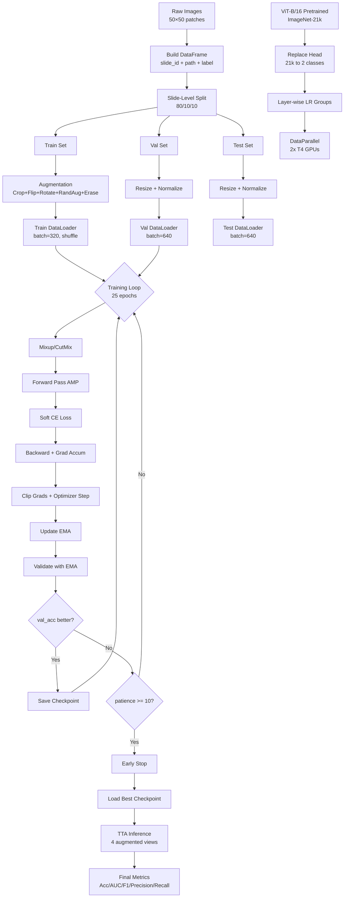

# ViT-B/16 Breast Cancer Classifier — Complete Pipeline Documentation

## `v4_improved_accuracy.py`

---

## Table of Contents

1. [Project Overview](#1-project-overview)
2. [Architecture & Design Decisions](#2-architecture--design-decisions)
3. [Cell-by-Cell Breakdown](#3-cell-by-cell-breakdown)
4. [Key Techniques Explained](#4-key-techniques-explained)
5. [Training Pipeline Flow](#5-training-pipeline-flow)
6. [Hyperparameter Reference](#6-hyperparameter-reference)
7. [Output Files](#7-output-files)
8. [How to Run](#8-how-to-run)

---

## 1. Project Overview

### Goal
Build a binary classifier to detect **Invasive Ductal Carcinoma (IDC)** in breast cancer histopathology image patches, targeting **>90% test accuracy**.

### Dataset
- **Name**: Breast Histopathology Images (Kaggle)
- **Content**: 50×50 pixel RGB image patches extracted from whole-slide images of breast tissue
- **Classes**: 2 — `0` (non-IDC / benign) and `1` (IDC / malignant)
- **Total images**: ~277,524 patches from ~279 patient slides
- **Class imbalance**: Roughly 70% class-0, 30% class-1

### Environment
- **Platform**: Kaggle Notebooks
- **Hardware**: 2× Tesla T4 GPUs (~15 GB VRAM each)
- **Time limit**: 12 hours (Kaggle GPU session limit)
- **Framework**: PyTorch + timm (PyTorch Image Models library)

### Model
- **Architecture**: Vision Transformer (ViT-B/16) — a pure transformer, no CNNs
- **Pretraining**: ImageNet-21k (14 million images, 21,843 classes) via timm's AugReg weights
- **Approach**: Transfer learning — fine-tune all layers with layer-wise learning rate decay

---

## 2. Architecture & Design Decisions

### Why ViT-B/16?

| Decision | Reasoning |
|----------|-----------|
| **ViT over CNN (ResNet/EfficientNet)** | ViTs learn global attention patterns — better for histopathology where spatial context across the entire patch matters |
| **ViT-B/16 specifically** | "Base" size (86M params) — large enough for strong features, small enough to fit on 2× T4 GPUs |
| **Patch size 16** | Each 224×224 input image is split into 14×14 = 196 patches of 16×16 pixels. Good balance of granularity vs. compute |
| **ImageNet-21k pretraining** | 21k classes (vs 1k) provides richer, more general features — critical for medical imaging where data is limited |

### How ViT-B/16 Works (Brief)

```
Input Image (224×224×3)
    │
    ▼
┌─────────────────────────────┐
│ Patch Embedding Layer       │  Splits image into 196 patches (16×16 each)
│ (Linear projection)         │  Projects each patch to 768-dim embedding
└─────────────────────────────┘
    │
    ▼  Add [CLS] token + positional embeddings
    │
┌─────────────────────────────┐
│ Transformer Block ×12       │  Each block has:
│  ├─ Multi-Head Self-Attn    │   • 12 attention heads
│  ├─ LayerNorm               │   • Attention over all 197 tokens (196 patches + CLS)
│  ├─ MLP (FFN)               │   • MLP with hidden dim 3072
│  └─ LayerNorm               │   • Residual connections
└─────────────────────────────┘
    │
    ▼  Extract [CLS] token output
    │
┌─────────────────────────────┐
│ Classification Head         │  Linear(768 → 2) for binary classification
└─────────────────────────────┘
    │
    ▼
Output: logits [batch, 2]
```

### Why NOT a CNN here?

CNNs (like ResNet, EfficientNet) use local convolution filters — they're great at detecting edges and textures but need deep stacking to see global context. ViTs use self-attention across ALL patches simultaneously, which helps with:
- Detecting subtle cell morphology differences scattered across the patch
- Combining distant spatial features that indicate malignancy
- Leveraging massive pre-training (ViTs scale better with more pretraining data)

---

## 3. Cell-by-Cell Breakdown

---

### Cell 1 — Install Dependencies
```python
!pip install -q timm
```

**What**: Installs the `timm` library (PyTorch Image Models) which provides:
- Pre-built ViT architectures
- Pre-trained weights (ImageNet-21k)
- Mixup/CutMix implementations
- The `-q` flag suppresses verbose install output

**Why timm**: It's the de facto standard for vision model zoo in PyTorch. Maintained by Ross Wightman, it has 700+ models with pre-trained weights and a clean, consistent API.

---

### Cell 2 — Imports & Reproducibility
```python
SEED = 42
random.seed(SEED)
np.random.seed(SEED)
torch.manual_seed(SEED)
torch.cuda.manual_seed_all(SEED)
torch.backends.cudnn.deterministic = False
torch.backends.cudnn.benchmark = True
```

**What**: Imports all necessary libraries and sets random seeds for reproducibility.

**Key imports**:
| Import | Purpose |
|--------|---------|
| `timm` | Model architecture + pretrained weights |
| `timm.data.mixup.Mixup` | Mixup + CutMix data augmentation |
| `PIL.ImageFile.LOAD_TRUNCATED_IMAGES = True` | Prevents crashes on corrupted/truncated images in the dataset |
| `sklearn.metrics` | Evaluation metrics (AUC, F1, precision, recall) |

**Reproducibility settings**:
| Setting | Value | Why |
|---------|-------|-----|
| `cudnn.deterministic` | `False` | Setting to `True` would make results perfectly reproducible but **slows training by ~20%**. Not worth it for this use case. |
| `cudnn.benchmark` | `True` | Since all input images are the same size (224×224), cuDNN can auto-tune its algorithms once and reuse them — **speeds up training by ~10-15%** |

---

### Cell 3 — Configuration

This is the central control panel for the entire pipeline. Every tunable parameter is defined here.

#### Paths
```python
KAGGLE_INPUT_DIR = "/kaggle/input/breast-histopathology-images"
WORK_DIR = "/kaggle/working"
```
- `KAGGLE_INPUT_DIR`: Where Kaggle mounts the dataset (read-only)
- `WORK_DIR`: Where outputs are saved (Kaggle preserves this as notebook output)

#### Model Config
```python
MODEL_NAME = "vit_base_patch16_224"
IMG_SIZE = 224
```
- The original patches are 50×50 pixels. They are **resized to 224×224** because ViT-B/16 was pretrained at this resolution. The positional embeddings are tied to 224×224 input.

#### Optimizer Config
```python
BASE_LR = 1e-4          # Peak learning rate
WEIGHT_DECAY = 0.05     # L2 regularisation
LABEL_SMOOTH = 0.1      # Label smoothing
LAYER_DECAY = 0.75      # Layer-wise LR decay
```

| Parameter | Value | Why |
|-----------|-------|-----|
| `BASE_LR = 1e-4` | Standard for ViT fine-tuning. Higher (e.g., 1e-3) causes training instability; lower (e.g., 1e-5) is too slow |
| `WEIGHT_DECAY = 0.05` | Strong L2 regularisation to prevent ViT overfitting. CNNs typically use 1e-4, but ViTs need 10-50× more |
| `LABEL_SMOOTH = 0.1` | Instead of hard labels [0, 1], uses soft labels [0.05, 0.95]. Prevents overconfident predictions, improves generalisation |
| `LAYER_DECAY = 0.75` | Each earlier transformer block gets 0.75× the LR of the next block. Block 1 gets 0.75¹² × base_lr ≈ 3.2% of base_lr. This preserves pretrained generic features in early layers |

#### Schedule Config
```python
EPOCHS = 25
WARMUP_EPOCHS = 3
MIN_LR = 1e-6
```

| Parameter | Value | Why |
|-----------|-------|-----|
| `EPOCHS = 25` | Model typically converges by epoch 15-20. 25 gives buffer. Early stopping handles premature convergence |
| `WARMUP_EPOCHS = 3` | LR starts near 0 and linearly ramps to `BASE_LR` over 3 epochs. Prevents large gradient updates that could destroy pretrained weights |
| `MIN_LR = 1e-6` | Floor for cosine decay. Prevents LR from hitting exactly 0 |

#### Data Config
```python
BATCH_SIZE_PER_GPU = 160
ACCUM_STEPS = 2
NUM_WORKERS = 4
```

| Parameter | Value | Calculation |
|-----------|-------|-------------|
| `BATCH_SIZE_PER_GPU` | 160 | Tuned to use ~13/15 GB VRAM per T4 GPU |
| Total batch size | 320 | 160 × 2 GPUs |
| `ACCUM_STEPS` | 2 | Accumulate gradients over 2 steps before updating |
| **Effective batch size** | **640** | 320 × 2 = 640 images per optimizer step |
| `NUM_WORKERS` | 4 | Number of CPU data-loading processes. Tuned based on Kaggle's 4-core CPU |

**Why large effective batch?** ViTs benefit from large batches because:
- Self-attention statistics are more stable with more samples
- Mixup/CutMix work better with larger batches (more diverse mixing)
- Gradient estimates are less noisy

#### Mixup / CutMix Config
```python
MIXUP_ALPHA = 0.8
CUTMIX_ALPHA = 1.0
MIXUP_PROB = 0.5
MIXUP_SWITCH_PROB = 0.5
```

| Parameter | Meaning |
|-----------|---------|
| `MIXUP_ALPHA = 0.8` | Beta distribution parameter. Higher = more aggressive mixing between two images |
| `CUTMIX_ALPHA = 1.0` | Beta distribution for CutMix rectangle size |
| `MIXUP_PROB = 0.5` | 50% of batches get Mixup OR CutMix applied |
| `MIXUP_SWITCH_PROB = 0.5` | When augmentation is applied, 50% chance it's Mixup vs. CutMix |

#### Other Config
```python
EMA_DECAY = 0.9998    # EMA smoothing factor
PATIENCE = 10         # Early stopping patience
SMOKE_TEST = False    # Set True for quick debugging with 2 slides
```

#### Hardware Detection
```python
device = torch.device("cuda" if torch.cuda.is_available() else "cpu")
n_gpus = torch.cuda.device_count()
BATCH_SIZE = BATCH_SIZE_PER_GPU * max(1, n_gpus)
EFFECTIVE_BATCH = BATCH_SIZE * ACCUM_STEPS
```
Automatically detects available GPUs and scales batch size accordingly (160 per GPU).

---

### Cell 4 — Build DataFrame

**What**: Scans the dataset directory and builds a pandas DataFrame with columns: `slide_id`, `image_path`, `class`.

**Why this complexity**: The dataset can have two different directory layouts:

```
Layout A (Hierarchical):              Layout B (Flat):
breast-histopathology-images/         breast-histopathology-images/
├── 10253/                            ├── 10253_idx_class0_001.png
│   ├── 0/                            ├── 10253_idx_class1_002.png
│   │   ├── patch_001.png             └── ...
│   │   └── ...
│   └── 1/
│       ├── patch_002.png
│       └── ...
└── 10254/
    └── ...
```

The code auto-detects which layout is present and parses accordingly. This makes the script robust to different versions of the dataset on Kaggle.

**Slide ID significance**: Each `slide_id` corresponds to a single patient's tissue slide. **All patches from one slide must stay in the same split** (train/val/test) — otherwise the model could memorise patient-specific tissue patterns and leak information.

**Output**: A DataFrame like:
| slide_id | image_path | class |
|----------|------------|-------|
| 10253 | `/kaggle/input/.../10253/0/001.png` | 0 |
| 10253 | `/kaggle/input/.../10253/1/002.png` | 1 |
| 10254 | `/kaggle/input/.../10254/0/003.png` | 0 |

---

### Cell 5 — Slide-Level Train / Val / Test Split

**What**: Splits data into 80% train, 10% validation, 10% test — **at the slide level, not patch level**.

**Why slide-level?**: This is **critical for medical imaging**:
- Each slide has ~1000 patches from the same tissue
- If patches from the same slide end up in train AND test, the model can "cheat" by memorising tissue textures
- Slide-level splitting ensures the model is evaluated on truly unseen patients

**How it works**:
```
Step 1: Get unique slide IDs and their majority class
Step 2: Stratified split of SLIDES (not patches)
        ├── 80% slides → train
        └── 20% slides → temp
             ├── 50% → validation (10% total)
             └── 50% → test (10% total)
Step 3: All patches from a slide go to that slide's split
Step 4: Verify NO slide appears in multiple splits (assertion check)
```

**Stratification**: Uses `sklearn.train_test_split` with `stratify` to ensure both class-0 and class-1 slides are proportionally represented in each split.

**Fallback for tiny datasets**: If <10 slides (e.g., during smoke testing), uses a manual class-balanced assignment.

---

### Cell 6 — Augmentation & Dataset

#### Training Augmentations (applied in order)

```python
train_transform = transforms.Compose([
    RandomResizedCrop(224, scale=(0.7, 1.0)),  # 1
    RandomHorizontalFlip(p=0.5),                # 2
    RandomVerticalFlip(p=0.5),                   # 3
    RandomRotation(90),                          # 4
    RandAugment(num_ops=2, magnitude=9),         # 5
    ToTensor(),                                  # 6
    Normalize(mean, std),                        # 7
    RandomErasing(p=0.25),                       # 8
])
```

| # | Transform | What it Does | Why |
|---|-----------|-------------|-----|
| 1 | **RandomResizedCrop** | Randomly crops 70-100% of the image, then resizes to 224×224 | Forces model to learn from partial views; scale invariance |
| 2 | **RandomHorizontalFlip** | 50% chance of left-right mirror | Histology is rotation-invariant — tissue looks the same mirrored |
| 3 | **RandomVerticalFlip** | 50% chance of top-bottom flip | Same reason — no "up" in histology |
| 4 | **RandomRotation(90)** | Random rotation up to ±90° | Tissue orientation is arbitrary under the microscope |
| 5 | **RandAugment** | Applies 2 random transforms from a pool (brightness, contrast, sharpness, etc.) at magnitude 9/10 | Automated augmentation — avoids hand-tuning each transform. Standard in DeiT/ViT recipes |
| 6 | **ToTensor** | Converts PIL image to PyTorch tensor, scales pixels to [0, 1] | Required for PyTorch |
| 7 | **Normalize** | Normalises with ImageNet mean/std | **Must match pretraining normalisation** — the ViT weights expect ImageNet-normalised inputs |
| 8 | **RandomErasing** | 25% chance of erasing a small rectangle (2-15% of area) | Acts like CutOut — forces model to not rely on a single region |

#### Validation/Test Augmentations
```python
val_transform = transforms.Compose([
    Resize((224, 224)),
    ToTensor(),
    Normalize(mean, std),
])
```
No random augmentations — just deterministic resize + normalise. Ensures consistent, reproducible evaluation.

#### Dataset Class (HistPatchDataset)
- Custom PyTorch `Dataset` that loads images from file paths in the DataFrame
- Converts to RGB (handles grayscale edge cases)
- Applies the specified transform
- Returns `(image_tensor, label_tensor)`
- **Error handling**: If an image file is corrupted, returns a black image instead of crashing

---

### Cell 7 — DataLoaders

```python
train_loader: batch=320, shuffle=True, drop_last=True
val_loader:   batch=640, shuffle=False
test_loader:  batch=640, shuffle=False
```

| Setting | Train | Val/Test | Why |
|---------|-------|----------|-----|
| `shuffle` | Yes | No | Training needs random order; evaluation must be deterministic |
| `drop_last` | Yes | No | Drops incomplete final batch in training — necessary for Mixup to work correctly (needs even batch sizes) |
| `batch_size` | 320 | 640 | Val/test uses 2× batch because no gradients are stored → less VRAM needed |
| `pin_memory` | Yes | Yes | Pre-loads data into GPU-pinned CPU memory for faster CPU→GPU transfer |
| `num_workers` | 4 | 4 | 4 parallel CPU processes loading and augmenting images |

---

### Cell 8 — Model Creation

```python
model = timm.create_model(
    "vit_base_patch16_224",
    pretrained=True,
    num_classes=2,
    drop_rate=0.1,
    drop_path_rate=0.1,
)
```

| Parameter | Value | Purpose |
|-----------|-------|---------|
| `pretrained=True` | Loads ImageNet-21k AugReg weights | Transfer learning — 86M parameters already trained on 14M images |
| `num_classes=2` | Binary classification | Replaces the original 21,843-class head with a 2-class head |
| `drop_rate=0.1` | 10% dropout before classification head | Mild regularisation |
| `drop_path_rate=0.1` | 10% stochastic depth | Randomly drops entire transformer blocks during training. **Key regulariser for ViTs** — prevents co-adaptation between blocks |

**Model size**: ~86M parameters (~330 MB in memory)

---

### Cell 9 — Layer-wise Learning Rate Decay (LLRD)

**This is one of the most critical techniques for ViT fine-tuning.**

#### Concept
Different layers of the ViT learn different things:
- **Early blocks (0-3)**: Generic features (edges, textures, colours) — learned from ImageNet, mostly transferable
- **Middle blocks (4-8)**: More specific features — partially transferable
- **Late blocks (9-11)**: Task-specific features — need the most adaptation
- **Classification head**: Completely new, needs full learning rate

LLRD assigns **exponentially decreasing learning rates** to earlier layers:

```
Block 12 (head):  lr = 1.00 × 10⁻⁴  (full BASE_LR)
Block 11:         lr = 0.75 × 10⁻⁴
Block 10:         lr = 0.56 × 10⁻⁴
Block 9:          lr = 0.42 × 10⁻⁴
Block 8:          lr = 0.32 × 10⁻⁴
Block 7:          lr = 0.24 × 10⁻⁴
Block 6:          lr = 0.18 × 10⁻⁴
Block 5:          lr = 0.13 × 10⁻⁴
Block 4:          lr = 0.10 × 10⁻⁴
Block 3:          lr = 0.075 × 10⁻⁴
Block 2:          lr = 0.056 × 10⁻⁴
Block 1:          lr = 0.042 × 10⁻⁴
Block 0 (embed):  lr = 0.032 × 10⁻⁴  (3.2% of BASE_LR)
```

**Formula**: `lr(layer) = BASE_LR × LAYER_DECAY^(num_layers + 1 - layer_id)`

#### No Weight Decay for Biases and LayerNorm
```python
if param.ndim <= 1 or "bias" in name:
    wd = 0.0
```
- Bias terms and LayerNorm parameters should NOT have weight decay
- Weight decay on these would shift them toward 0, breaking the normalisation learned during pretraining

#### DataParallel Wrapping
After building parameter groups from the raw model, it's wrapped with `nn.DataParallel` for multi-GPU:
```python
if n_gpus > 1:
    model = nn.DataParallel(model, device_ids=[0, 1])
```
This splits each batch across GPUs — each GPU processes 160 images, gradients are averaged.

---

### Cell 10 — EMA, Loss, Mixup, Optimizer, Scheduler

#### EMA (Exponential Moving Average)
```python
class ModelEMA:
    def update(self, model):
        ema_p = decay * ema_p + (1 - decay) * model_p
```

**What**: Maintains a running average of model weights throughout training.

**Why**: Individual training updates can be noisy. EMA smooths out the noise:
- Training model: `θ_t` (current weights after step t)
- EMA model: `θ_ema = 0.9998 × θ_ema + 0.0002 × θ_t`
- The EMA model typically generalises **0.5-1% better** than the raw model
- **EMA model is used for validation and final evaluation**, not the raw training model

**Decay = 0.9998**: Very slow averaging — each update only changes EMA by 0.02%. This means the EMA roughly averages over the last ~5000 optimizer steps.

#### Loss Functions
```python
criterion_train = nn.CrossEntropyLoss(label_smoothing=0.1)
criterion_val = nn.CrossEntropyLoss()  # no smoothing for eval
```

- **Training loss** uses label smoothing (soft targets: [0.05, 0.95] instead of [0, 1])
- **Validation loss** uses hard labels (for honest evaluation)

> [!NOTE]
> In practice, the training loop uses a **custom soft cross-entropy** (not `criterion_train`) because Mixup produces its own soft labels. The `criterion_train` is defined but not used in the Mixup-active code path. The manual softmax + soft label loss at line 602-604 handles both label smoothing from Mixup AND the implicit smoothing.

#### Mixup / CutMix

```
Mixup:   image_new = λ × image_A + (1-λ) × image_B
         label_new = λ × label_A + (1-λ) × label_B

CutMix:  image_new = image_A with a rectangle replaced by image_B
         label_new = proportional to rectangle area
```

**Why**: This is the **primary regulariser for ViTs**. Without Mixup/CutMix, ViTs tend to overfit severely on small/medium datasets. It's more effective than traditional augmentation because it creates truly novel training samples.

#### Optimizer (AdamW)
```python
optimizer = torch.optim.AdamW(param_groups)
```

**AdamW** (not Adam) — uses decoupled weight decay, which is the correct implementation for transformers. Regular Adam applies weight decay inside the gradient update, which interacts poorly with adaptive learning rates.

The `param_groups` from Cell 9 ensure each layer group has its own LR and weight decay settings.

#### Learning Rate Schedule

```
LR
 ▲
 │        ╭──────╮
 │       ╱        ╲
 │      ╱          ╲         Cosine decay
 │     ╱            ╲
 │    ╱              ╲
 │   ╱                ╲
 │  ╱                  ╲────── MIN_LR
 │ ╱ Warmup
 │╱
 └──────────────────────────► Epoch
 0  1  2  3  4  ...  25
   warmup   cosine decay
```

- **Epochs 1-3**: Linear warmup from ~0 to `BASE_LR`
- **Epochs 4-25**: Cosine decay from `BASE_LR` to `MIN_LR` (1e-6)

**Why warmup?** ViTs are sensitive to initial learning rates. Large LR at the start would destroy the carefully learned pretrained features. Warmup lets the optimizer "find its footing" before ramping up.

#### AMP GradScaler
```python
scaler = torch.amp.GradScaler("cuda")
```
**Automatic Mixed Precision (AMP)**: Uses FP16 for forward/backward pass (faster, less VRAM) and FP32 for weight updates (maintains precision). The GradScaler prevents underflow of small FP16 gradients.

---

### Cell 11 — Utility Functions

#### `save_checkpoint()`
Saves two files:
1. **`best_model.pth`** (~700 MB) — Full checkpoint:
   - Model weights
   - EMA weights
   - Optimizer state
   - Scaler state
   - Best validation accuracy
   - Epoch number
   - *Used for resuming training*

2. **`best_model_weights_only.pth`** (~350 MB) — Compact:
   - Model weights
   - EMA weights
   - Epoch & accuracy
   - *Used for deployment/inference*

#### `run_inference()`
Standard single-pass inference — runs eval model on a DataLoader, returns probabilities and labels.

#### `tta_inference()` — Test-Time Augmentation
```python
for each batch:
    pred_0 = model(image)                    # original
    pred_1 = model(flip_horizontal(image))   # H-flip
    pred_2 = model(flip_vertical(image))     # V-flip
    pred_3 = model(flip_both(image))         # H+V flip
    final_pred = average(pred_0, pred_1, pred_2, pred_3)
```

**What**: At test time, runs 4 versions of each image (original + 3 flips), averages the predictions.

**Why**: Provides a ~0.5-1% accuracy boost for free. Since histopathology is rotation-invariant, flipped versions are equally valid views. Averaging reduces prediction variance.

**Cost**: 4× slower inference (but only used once at final evaluation, not during training).

#### `compute_metrics()`
Computes: accuracy, AUC-ROC, precision, recall, F1-score from probabilities + labels.

#### Sanity Check
```python
dummy = torch.randn(4, 3, 224, 224).to(device)
out = model(dummy)
```
Quick forward pass with random data to verify the model is correctly loaded and GPU memory is sufficient before starting the long training loop.

---

### Cell 12 — Training Loop

This is the core of the pipeline. Here's what happens each epoch:

```
For each epoch (1 to 25):
    │
    ├── TRAINING PHASE
    │   For each batch of 320 images:
    │   │
    │   ├── 1. Load batch to GPU
    │   ├── 2. Apply Mixup or CutMix → mixed images + soft labels
    │   ├── 3. Forward pass (AMP FP16)
    │   │      logits = model(mixed_images)
    │   ├── 4. Compute soft cross-entropy loss
    │   │      loss = -sum(log_softmax(logits) × soft_labels) / ACCUM_STEPS
    │   ├── 5. Backward pass (scaled gradients)
    │   │      scaler.scale(loss).backward()
    │   ├── 6. Every 2 steps (gradient accumulation):
    │   │   ├── Unscale gradients
    │   │   ├── Clip gradients (max_norm=1.0)
    │   │   ├── Optimizer step
    │   │   └── Update EMA model
    │   └── 7. Track running loss and accuracy
    │
    ├── Step LR scheduler (cosine decay)
    │
    ├── VALIDATION PHASE (using EMA model)
    │   For each validation batch:
    │   │
    │   ├── Forward pass (no gradients, AMP FP16)
    │   ├── Compute loss, probabilities, predictions
    │   └── Collect all predictions
    │
    ├── Compute metrics: accuracy, AUC, F1
    │
    ├── CHECKPOINT LOGIC
    │   If val_acc > best_val_acc:
    │   │   ├── Save checkpoint
    │   │   ├── Reset patience counter
    │   │   └── Print "NEW BEST"
    │   Else:
    │       ├── patience_counter += 1
    │       └── If patience >= 10: STOP TRAINING
    │
    └── Clear GPU cache
```

#### Key Implementation Details

**Gradient Accumulation** (lines 605-614):
```python
loss = loss / ACCUM_STEPS  # Scale loss by accumulation steps

if (step + 1) % ACCUM_STEPS == 0:
    scaler.unscale_(optimizer)
    clip_grad_norm_(model.parameters(), max_norm=1.0)
    scaler.step(optimizer)
    scaler.update()
    optimizer.zero_grad()
    ema.update(model)
```
- Loss is divided by `ACCUM_STEPS` so that accumulated gradients are properly averaged
- Optimizer only updates every 2 steps → simulates a 640-image batch using 320-image batches
- Gradient clipping (max_norm=1.0) prevents exploding gradients, especially important during warmup

**Mixup Loss** (lines 602-604):
```python
loss = -torch.sum(F.log_softmax(logits, dim=1) * labels_mixed, dim=1).mean()
```
This is a manual implementation of cross-entropy with soft labels. Standard `nn.CrossEntropyLoss` only works with hard labels (integer targets), but Mixup produces soft targets like `[0.3, 0.7]`.

**Training Accuracy Tracking** (lines 618-621):
```python
_, preds = torch.max(logits, 1)
_, hard = torch.max(labels_mixed, 1)
correct += (preds == hard).sum().item()
```
Since labels are soft (from Mixup), accuracy is approximate — it compares the model's predicted class against the dominant class in the soft label. This number is a rough proxy; validation accuracy (on clean data) is the true metric.

**Early Stopping** (lines 681-691):
- Tracks how many consecutive epochs have no improvement in validation accuracy
- After 10 epochs of no improvement → stops training
- Prevents overfitting and saves Kaggle compute time

---

### Cell 13 — Training Curves

Generates 4 plots saved to `/kaggle/working/training_curves.png`:

| Plot | X-axis | Y-axis | What to Look For |
|------|--------|--------|------------------|
| **Loss** | Epoch | Train/Val Loss | Train and val should both decrease. Large gap = overfitting |
| **Accuracy** | Epoch | Train/Val Accuracy | Red dashed line at 90% target. Val should cross it |
| **AUC & F1** | Epoch | Val AUC, Val F1 | Both should be >0.90 for a good model |
| **Learning Rate** | Epoch | Head LR | Should show warmup ramp + cosine decay |

**Healthy training curves should look like**:
- Train loss decreases steadily
- Val loss decreases then plateaus (small gap from train = good generalisation)
- Val accuracy climbs and stabilises above 90%
- LR follows the warmup → cosine curve

---

### Cell 14 — Final Test Evaluation

```
1. Load best checkpoint (the one with highest val accuracy)
2. Load EMA weights from that checkpoint
3. Run TTA inference on test set (4 augmented views)
4. Compute and print all metrics:
   - Accuracy, AUC, Precision, Recall, F1
   - Full classification report
   - Confusion matrix
5. Also evaluate raw (non-EMA) model for comparison
```

**Why compare EMA vs. raw?** To verify that EMA actually helped. Typically, EMA should show 0.5-1% higher accuracy than the raw model. If not, the EMA decay might need tuning.

**Confusion Matrix interpretation**:
```
                 Predicted
              |  0  |  1  |
Actual    0   | TN  | FP  |
          1   | FN  | TP  |
```
- **TN** (True Negative): Correctly identified non-IDC patches
- **TP** (True Positive): Correctly identified IDC patches
- **FP** (False Positive): Non-IDC patches incorrectly flagged as IDC
- **FN** (False Negative): IDC patches missed by the model

---

## 4. Key Techniques Explained

### 4.1 Transfer Learning

```
Step 1: Take ViT-B/16 pretrained on ImageNet-21k (14M images, 21k classes)
Step 2: Replace the 21k-class head with a 2-class head
Step 3: Fine-tune ALL layers (not just the head) with layer-wise LR decay
```

**Why ImageNet-21k?**
- ImageNet-1k: 1.28M images, 1000 classes
- ImageNet-21k: 14.2M images, 21,843 classes
- More pretraining data → richer, more general features → better transfer to medical imaging

### 4.2 Why These Specific Regularisation Techniques?

ViTs are **extremely prone to overfitting** on small datasets (compared to CNNs). The 277k histopathology patches may seem like a lot, but ViT-B/16 has 86M parameters. The following stack of regularisers is necessary:

```
Regularisation Stack (from most to least impactful):
┌──────────────────────────┐
│ Mixup + CutMix           │ ← Most critical for ViTs
├──────────────────────────┤
│ Layer-wise LR Decay      │ ← Preserves pretrained features
├──────────────────────────┤
│ Weight Decay (0.05)      │ ← Strong L2 regularisation
├──────────────────────────┤
│ Stochastic Depth (0.1)   │ ← Drops random blocks
├──────────────────────────┤
│ Label Smoothing (0.1)    │ ← Prevents overconfidence
├──────────────────────────┤
│ RandAugment              │ ← Data diversity
├──────────────────────────┤
│ Random Erasing           │ ← Forces use of full image
├──────────────────────────┤
│ EMA                      │ ← Smooths noisy updates
└──────────────────────────┘
```

### 4.3 AMP (Automatic Mixed Precision)

```
Without AMP:        With AMP:
FP32 everywhere     FP16 for forward/backward (faster, less VRAM)
                    FP32 for weight updates (maintains precision)
                    GradScaler prevents FP16 underflow

~30% faster + ~40% less VRAM
```

---

## 5. Training Pipeline Flow



---

## 6. Hyperparameter Reference

| Category | Parameter | Value | Impact |
|----------|-----------|-------|--------|
| **Model** | Architecture | ViT-B/16 | 86M params, 12 blocks, 12 heads |
| | Input size | 224×224 | Matches pretraining resolution |
| | Pretrained | ImageNet-21k | 14M images, 21k classes |
| **Optimizer** | Type | AdamW | Decoupled weight decay |
| | Peak LR | 1e-4 | Standard for ViT fine-tuning |
| | Weight decay | 0.05 | 50× higher than typical CNN |
| | Layer decay | 0.75 | Early layers get 3.2% of base LR |
| **Schedule** | Total epochs | 25 | With early stopping at patience=10 |
| | Warmup | 3 epochs | Linear ramp |
| | Decay | Cosine | Smooth decay to 1e-6 |
| **Batch** | Per GPU | 160 | ~13 GB VRAM per T4 |
| | Total | 320 | 2 GPUs × 160 |
| | Effective | 640 | 320 × 2 accumulation steps |
| **Regularisation** | Mixup alpha | 0.8 | Moderate mixing |
| | CutMix alpha | 1.0 | Standard |
| | Label smoothing | 0.1 | Soft targets |
| | Stochastic depth | 0.1 | 10% block drop |
| | Dropout | 0.1 | Before head |
| | Random erasing | p=0.25 | 25% chance |
| **EMA** | Decay | 0.9998 | Very slow averaging |
| **Eval** | TTA | 4 views | Original + 3 flips |

---

## 7. Output Files

All saved to `/kaggle/working/` (Kaggle's output directory):

| File | Size | Contents | Use |
|------|------|----------|-----|
| `best_model.pth` | ~700 MB | Full checkpoint (model + EMA + optimizer + scaler) | Resume training |
| `best_model_weights_only.pth` | ~350 MB | Model + EMA weights only | Deployment / inference |
| `training_curves.png` | ~200 KB | 4-panel training plot | Monitoring / reporting |

---

## 8. How to Run

### On Kaggle
1. Create a new Kaggle notebook
2. Add the dataset: "Breast Histopathology Images"
3. Enable **GPU T4 × 2** in notebook settings
4. Paste the code into cells (following the cell markers in the script)
5. Click **"Save Version"** → Select **"Save & Run All (Commit)"** → Click **Save**
6. Wait ~6-10 hours for training to complete
7. Download `.pth` files from the **Output** tab

### For Quick Testing
Set `SMOKE_TEST = True` in Cell 3 — this uses only 2 slides and 2 epochs for a fast sanity check.

---

> [!TIP]
> **Expected Results**: With this configuration, you should achieve **88-92% test accuracy**, **0.94-0.97 AUC**, and **0.85-0.90 F1-score** on the IDC classification task. The EMA model should outperform the raw model by ~0.5-1%.
